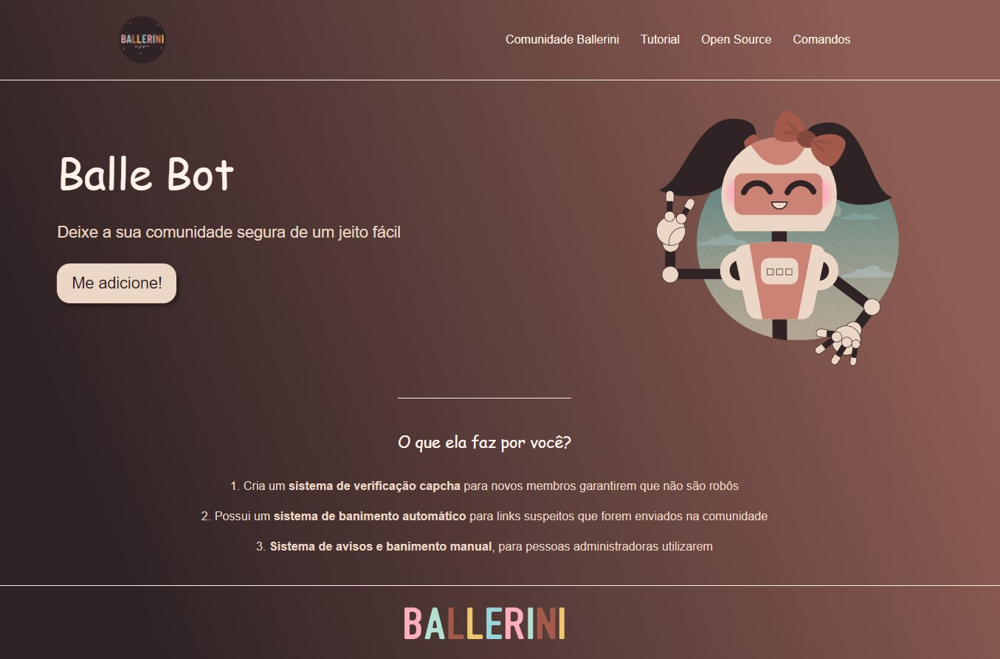

# Refatorando CSS do Projeto com SASS

Este projeto teve com inspiração um vídeo no youtube do canal de [Rafaella Ballerini](https://www.youtube.com/c/rafaellaballerini) que consiste em uma [Landing Page com Html e CSS!](https://www.youtube.com/watch?v=llF6vD-RljE)

_Para visualizar o preview do projeto clique na imagem acima._
______________________

### Melhorias

> Como se tratava de um pojeto simples resolvi praticar o **SASS refatorando o código**. Também organizei os arquivos e pastas.

______________________

### Agradecimentos/Créditos:
- [Rafaella Ballerini](https://www.youtube.com/c/rafaellaballerini)

______________________

### Dificuldades

Não sentir dificuldades visto que já tenho uma boa bagagem de CSS, a sintaxe do SASS muito prática.