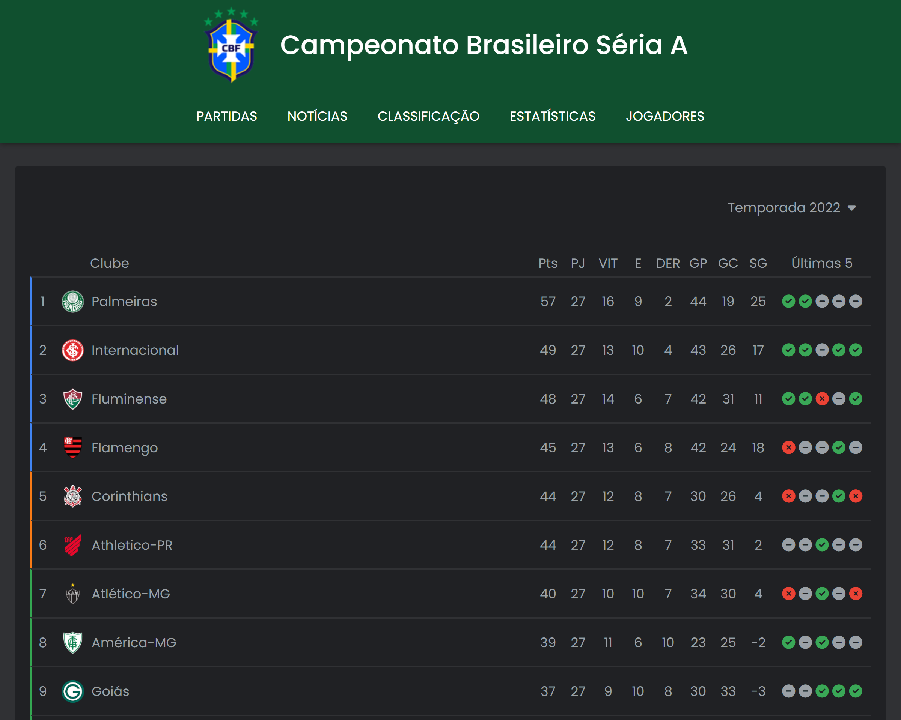

# Recriado a tabela do Campeonato Brasileiro da Série A

Tiver como [inspiração no vídeo](https://www.youtube.com/watch?v=8zYxYj0MrsE) na internet do [Canal do Youtube Agnaldo Guimarães](https://www.youtube.com/c/AgnaldoGuimar%C3%A3es). A proposta do autor do vídeo era recriar a tabela usando table, grid e flex box. Porém como ele publica um vídeo por semana, decidi fazer todo o projeto antecipadamente. Foi um projeto divertido e que todos os aprendizes deviam recriar devido a praticidade do grid e os desafios da responsividade.

_Para visualizar o preview do projeto clique na imagem acima._
______________________

### Melhorias

- Foi criado o projeto totalmente com SASS.
- Decidi fazer apenas modo escuro.
- Defini tamanho padrão máximo de 1200px.
- [Diferentemente da tabela original](https://www.google.com/search?q=classifica%C3%A7%C3%A3o+campeonato+brasileiro&sxsrf=ALiCzsaGWujFi8gmf2fu3GuejIJl0WgxUA%3A1663788615552&ei=R2YrY9CtIfSS0AbivaOwCg&ved=0ahUKEwiQ7aTLz6b6AhV0CdQKHeLeCKYQ4dUDCA4&uact=5&oq=classifica%C3%A7%C3%A3o+campeonato+brasileiro&gs_lcp=Cgxnd3Mtd2l6LXNlcnAQAzIECAAQDTIECAAQDTIHCAAQsQMQDTIECAAQDTIECAAQDTIHCC4Q1AIQDTIECAAQDTIECAAQDTIECAAQDTIECAAQDToECAAQRzoHCCMQsQIQJzoGCAAQHhAHOgoILhCxAxCDARBDOgoILhCxAxCDARAKOgoIABCxAxCDARAKOgcILhCxAxAKSgQIQRgASgQIRhgAULoEWIgUYJwVaABwAngBgAGcAogB7xKSAQYwLjEyLjGYAQCgAQHIAQjAAQE&sclient=gws-wiz-serp#sie=lg;/g/11sfc7_5p3;2;/m/0fnk7q;st;fp;1;;;) do Google que utiliza < table > decidi fazer tudo em Flex/Grid.

______________________

### Agradecimentos/Créditos:
- [Agnaldo Guimarães](https://www.youtube.com/c/AgnaldoGuimar%C3%A3es)
- [Google Brasil](https://www.google.com.br)
- [Font Awesome](https://fontawesome.com/)
- [Google Fonts](https://fonts.google.com/)

Logos dos times utilizados nestes projetos bem como da CBF, pertencem as suas respectivas marcas.

______________________

### Dificuldades

Não sentir dificuldades visto que já tenho uma boa bagagem de CSS, a sintaxe do SASS muito prática.